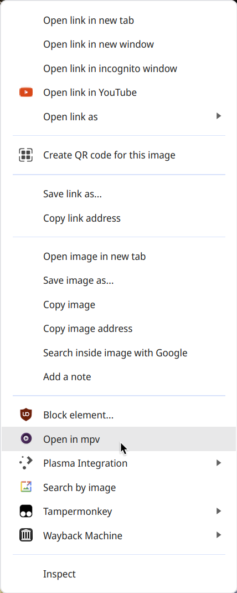

# Open in mpv

[](https://github.com/Tatsh/open-in-mpv/actions?query=workflow%3AQA)
[](https://github.com/Tatsh/open-in-mpv/actions?query=workflow%3A%22Lint+python%22)
[[](https://app.fossa.com/projects/git%2Bgithub.com%2FTatsh%2Fopen-in-mpv?ref=badge_shield)
/badge.svg>)](https://github.com/Tatsh/open-in-mpv/actions?query=workflow%3A%22Lint+python+%28macOS%29%22)



This browser extension displays a context menu item _Open in mpv_ for links.
When clicked it will pass the URL of the link to mpv (which must be `PATH`).

If you have `youtube-dl` installed and in `PATH`, then mpv will try to use it
to resolve URLs it cannot handle. This means you can right-click on any YouTube
video, choose `Open in mpv` and view the video with mpv.

## Installation

First, install the extension. Quit your browser.

Follow [Google's instructions](https://developer.chrome.com/extensions/nativeMessaging#native-messaging-host-location)
to install the `sh.tat.open_in_mpv.json.in` file (remove the `.in` ending). You
need to modify it, changing `@BINPATH@` to fit your system.

An example script `open-in-mpv` is provided but you do not have to use it.

## An example installation for Linux

```sh
killall chrome
sudo mkdir -p /etc/chromium/native-messaging-hosts/
sudo cp sh.tat.open_in_mpv.json.in /etc/chromium/native-messaging-hosts/sh.tat.open_in_mpv.json
mkdir -p ~/.local/bin
cp open-in-mpv ~/.local/bin/
```

For this case, `@BINPATH@` should be `/home/username/.local/bin` in
`/etc/chromium/native-messaging-hosts/sh.tat.open_in_mpv.json`. `~/.local/bin`
must be in PATH, including from X's point of view, usually sourced in via
`~/.xprofile` or similar.

## Known issues

At this time, Windows is not supported by the `open-in-mpv` Python script. It
might work, but it is not supported.


## License
[](https://app.fossa.com/projects/git%2Bgithub.com%2FTatsh%2Fopen-in-mpv?ref=badge_large)